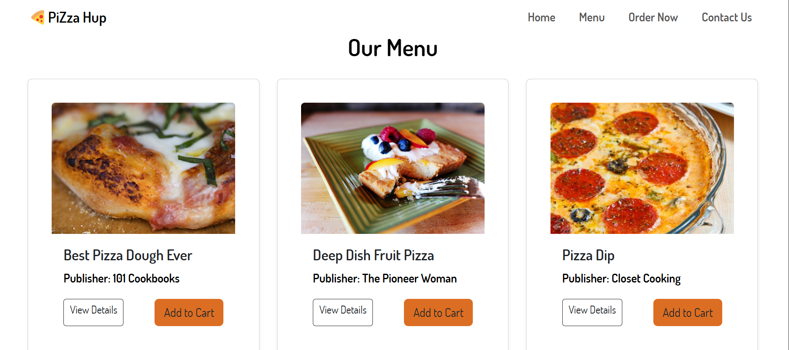
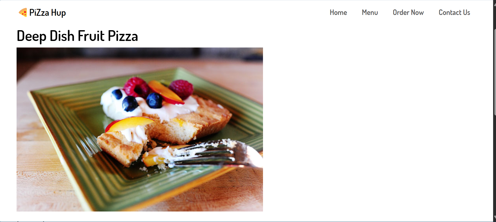
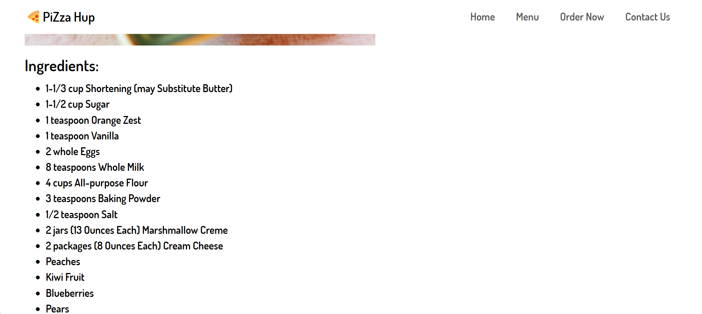
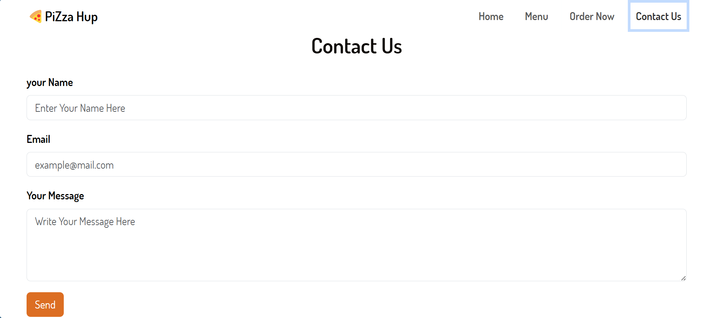

# PiZza Hup

## Overview

PiZza Hup is a modern pizza ordering web application built using React. It features a responsive design, dynamic menu from an external API, and a seamless ordering experience. The app demonstrates core concepts of React development including routing, state management, and integration with Bootstrap for UI styling.

## Features

* **Responsive Design**: Works seamlessly on mobile, tablet, and desktop devices
* **Dynamic Menu**: Loads pizza data from a remote API (Forkify)
* **Pizza Details**: View ingredients and details of each pizza
* **Ordering System**: Place orders with prefilled item name
* **Contact Form**: Allows users to submit inquiries
* **Routing**: Multi-page routing using React Router v6+

## Technologies Used

### Frontend

* **React 18**: JavaScript library for building UI components
* **React Router DOM v6+**: Handles client-side routing
* **Bootstrap 5**: For responsive layout and styled UI components
* **Axios**: For HTTP requests to external API

### Development Tools

* **Vite**: Fast frontend build tool for React projects
* **npm**: JavaScript package manager

### API

* **Forkify API**: Public API for fetching pizza recipes and details

## Getting Started

### Prerequisites

* Node.js (v16 or higher)
* npm (v7 or higher)

### Installation

1. Clone the repository

```bash
https://github.com/Basmala212
cd pizza-hup
```

2. Install dependencies

```bash
npm install
```

3. Start the development server

```bash
npm run dev
```

4. Open in your browser:

```
http://localhost:5173
```

### Building for Production

```bash
npm run build
```

The output will be saved in the `dist/` folder.

## Project Structure

```
├── public/              # Public images and assets
├── src/
│   ├── assets/          # Static assets (e.g., hero image)
│   ├── components/      # Navbar, Footer, PizzaCard
│   ├── pages/           # Home, Menu, Order, ContactUs, NotFound, ViewDetails
│   ├── services/        # API services using axios
│   ├── App.jsx          # Main app with routing
│   ├── App.css          # App-wide styles
│   ├── index.css        # Global styles
│   └── main.jsx         # App entry point
├── package.json         # Dependencies and scripts
├── package-lock.json    # Version lock file
└── README.md            # Project documentation
```

## Screenshots

### Home :


### Menu :


### ViewDetails :


### Order :

### contactUs :



## License

MIT

## Acknowledgements

* [Forkify API](https://forkify-api.herokuapp.com/) for providing the product data
* [React](https://reactjs.org/) for the amazing library
* [Bootstrap](https://getbootstrap.com/)  for the responsive design framework
* [Vite](https://vitejs.dev/) for the blazing fast build tool
